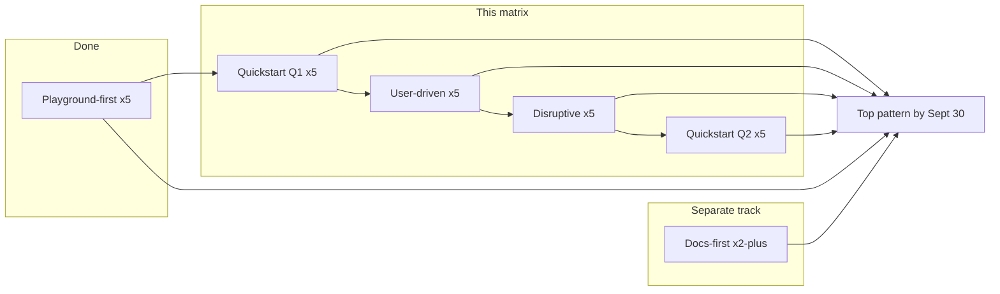

# ElevenAPI Landing Archetype Experiment Matrix

**OKR:** Build and test the four API/Developer landing-page archetypes — docs-first, playground-first, quickstart pass-through, and user-driven vs. disruptive — at ≥2 experiments per archetype, to identify the top developer-acquisition pattern by Sept 30.

**Scope of this doc:** Quickstart / pass-through and user-driven vs disruptive variants for the five live playground-first pages. Playground-first is the holdout control. Docs-first is a separate track (see §7).

| Control URL | Product slug |
|-------------|--------------|
| https://join.elevenlabs.io/api/developer-api | `dev` |
| https://join.elevenlabs.io/api/voice-design | `vd` |
| https://join.elevenlabs.io/api/speech-to-text | `stt` |
| https://join.elevenlabs.io/api/conversational-ai | `cai` |
| https://join.elevenlabs.io/api/dubbing-translation | `dub` |

---

## 1. Shared experiment rules

| Rule | Value |
|------|--------|
| Offer | 10K free credits, no credit card |
| Primary CTA destination | `https://elevenlabs.io/app/developers/api-keys` (product-specific app entry where noted) |
| Secondary CTA | Text link to product docs or “Talk to sales” where specified |
| Strip / bury vs playground-first | Interactive Run playground, full API product grid, long G2 review carousel, generic FAQ wall (max 3 product FAQs on non-disruptive variants) |
| Primary KPI | API-key signup rate (visits → key created) |
| Secondary KPI | Activated first API call within 24h of signup |
| Guardrails | Bounce rate, time-to-key, cost per activated developer |
| Tracking params on all CTAs | `utm_source=paid`, `utm_medium=cpc`, `utm_campaign=elevenapi_{product}`, `utm_content={variant_id}`, plus custom dims `archetype`, `product`, `variant_id` |

### UTM / variant naming

```
utm_campaign = elevenapi_{product}     # e.g. elevenapi_stt
utm_content  = {variant_id}            # e.g. stt-Q1
archetype    = quickstart | user_driven | disruptive | playground_first
product      = dev | vd | stt | cai | dub
variant_id   = {product}-{Q1|Q2|UD|D}
```

Suggested path convention when cloning pages:

```
/api/{product-path}?v={variant_id}
# or dedicated paths:
/api/{product-path}/q1
/api/{product-path}/q2
/api/{product-path}/ud
/api/{product-path}/d
```

### Archetype definitions

| Archetype | Core mechanic | Success signal |
|-----------|---------------|----------------|
| **Playground-first** (control) | Interactive multi-language code playground with Run above the fold | Signup + activation from “try then commit” |
| **Quickstart / pass-through** | Thin shell → shortest path to first API call | Time-to-key, signup rate, first call ≤24h |
| **User-driven** | Intent routing + low friction; visitor chooses path | Intent-path CTR, qualified signup/activation |
| **Disruptive** | Pattern interrupt: bold claim, unconventional layout, forced attention | CTR/signup lift vs control (bounce lift also informative) |

**Volume:** 2 quickstart + 1 user-driven + 1 disruptive × 5 products = **20 variants** (exceeds ≥2 per archetype).

---

## 2. Full experiment matrix (20 variants)

### 2.1 Quickstart — Q1 “60-second path” (pass-through shell)

Shared above-fold wire:

1. Minimal nav (logo + “Docs” text link)
2. Product eyebrow
3. H1 (time / one-request focus)
4. One-sentence subhead (offer + no CC)
5. Giant primary CTA
6. Static install one-liner + one language snippet (not runnable)
7. Single logo row (optional, max one)

Below fold: 3 numbered steps only → one proof line → sticky CTA. Target **&lt;1.5 desktop screen heights**. No playground.

| Variant ID | Control URL | H1 | Subhead | Primary CTA | Snippet focus | Removed vs control | Hypothesis |
|------------|-------------|----|---------|-------------|---------------|--------------------|------------|
| `dev-Q1` | /api/developer-api | Ship voice AI in one request | Get your free API key and make a production TTS call in under a minute. 10K credits, no credit card. | Get your free API key | TTS Flash cURL (~75ms first-byte claim) | Playground Run UI, API grid, reviews carousel, long FAQ, enterprise block above fold | Pass-through beats playground on cold paid CTR and time-to-key for platform searches |
| `vd-Q1` | /api/voice-design | Describe a voice. Get an ownable voice ID. | Text prompt in → brand-new voice out. Serve it on every ElevenAPI surface. 10K free credits. | Get your free API key | `text_to_voice.design` (Python) | Same strip set; demote cloning/library crosstalk | Outcome-led one-liner converts voice-design keyword traffic faster than try-before-signup |
| `stt-Q1` | /api/speech-to-text | Hosted Scribe. No Whisper cluster. | Near-perfect STT in 90+ languages — realtime or batch — without self-hosting. 10K free credits. | Get your free API key | `speech_to_text.convert` + `diarize=True` | Same strip; bury comparison FAQ below steps | Competitive zero-ops framing lifts signup vs playground for Whisper-intent queries |
| `cai-Q1` | /api/conversational-ai | Create a voice agent, then connect the socket | One create call for turn-taking, interruptions, and realtime voice on your LLM. 10K free credits. | Get your free API key | `conversational_ai.agents.create` + “then WebSocket” note | Same strip; Agents app deep-link OK as primary if key is created in-flow | Agent-create-first pass-through beats playground for “voice agent API” traffic |
| `dub-Q1` | /api/dubbing-translation | One POST. 90+ language dubs. | Translate and re-voice video in one call — speaker identity, timing, and tone preserved. 10K free credits. | Get your free API key | `dubbing.create` + `target_lang` | Same strip; keep 3-step localize block as the only below-fold | One-call claim + thin page wins localization keyword CTR vs long playground page |

**CTA URLs (Q1):**

```
https://elevenlabs.io/app/developers/api-keys?utm_campaign=elevenapi_{product}&utm_content={variant_id}&archetype=quickstart
```

`cai-Q1` may use Agents app entry after auth; `dub-Q1` may use `/app/dubbing` as equal-weight alternate measured separately only if tagged `cta=dubbing_app`.

---

### 2.2 Quickstart — Q2 “Guided checklist”

Shared above-fold wire:

1. Minimal nav
2. H1 = product outcome
3. Subhead = “Four steps. First result today.”
4. Interactive checklist (not a code runner):
   - ☐ Create account
   - ☐ Copy API key
   - ☐ Paste this snippet
   - ☐ Hear / see result
5. Primary CTA after step 2 and step 4
6. Stack chips only switch the static snippet language

| Variant ID | H1 | Subhead | Primary CTA | Checklist payload | Removed vs control | Hypothesis |
|------------|----|---------|-------------|-------------------|--------------------|------------|
| `dev-Q2` | Your first ElevenAPI call, step by step | Sign up, grab a key, paste four lines, hear audio. 10K free credits. | Get 10K free credits | signup → api-keys → `pip install elevenlabs` + 4-line TTS → play output | Playground, API grid, reviews, pricing wall | Guided checklist raises 24h activation vs Q1 and vs playground |
| `vd-Q2` | Design a brand voice in four steps | From text description to reusable `voice_id` you own. | Get your free API key | signup → key → paste voice description prompt → save voice → TTS with that id | Same | Multi-step design flow reduces confusion vs single design call |
| `stt-Q2` | Transcribe your first file in minutes | Upload audio, get text + speakers + timestamps. Optional realtime path. | Get your free API key | signup → key → upload sample → return transcript; branch link to realtime WS docs | Same | Checklist with file upload mental model beats abstract playground for STT |
| `cai-Q2` | Live agent in four steps | Create → voice → WebSocket → talk. Your LLM stays yours. | Open Agents & get API key | create agent → pick voice → connect WS → talk; deep-link Conversational AI dashboard | Same | Dashboard-linked checklist activates agents faster than code-only playground |
| `dub-Q2` | Localize a video in three API steps | Send file → set languages → pull finished dubs. No ASR/TTS glue. | Get your free API key | Entire page = existing “Dub at scale in 3 steps” content; no playground | Playground + long lower page | Elevating the 3-step block to the whole page beats burying it under a runner |

---

### 2.3 User-driven

Shared above-fold wire:

1. Short H1 (question) + one supporting sentence
2. **Intent cards** (3–5) as primary interaction
3. Stack chips (Python / Node / cURL) — change next-step docs link only, not a playground
4. Soft “Continue” after selection → personalized destination
5. Always-visible escape hatch: **Just give me an API key**

| Variant ID | H1 | Subhead | Primary CTA | Intent cards → routes | Removed vs control | Hypothesis |
|------------|----|---------|-------------|----------------------|--------------------|------------|
| `dev-UD` | What are you building with voice? | Pick a path — we’ll send you to the right quickstart. Or grab a key now. | Continue / Just give me an API key | TTS app → TTS docs QS; Realtime agent → Agents; Transcription → STT; Video localization → Dubbing; Not sure → platform signup | Persuasion chrome, playground, pricing, reviews | Intent routing improves activation quality even if raw CTR is flat |
| `vd-UD` | How do you want to get a custom voice? | Design, clone, browse, or drop straight into TTS. | Continue / Just give me an API key | Generate from text → Voice Design docs; Clone from audio → PVC/cloning; Browse library → Voice Library; Embed in TTS now → TTS + voice_id QS | Same | Separating design vs clone vs library cuts misfires and raises qualified signup |
| `stt-UD` | What do you need to transcribe? | Realtime, batch, multilingual catalog, or replacing Whisper — choose your path. | Continue / Just give me an API key | Realtime &lt;150ms → WS docs; Batch/meetings → batch QS; Multilingual catalog → languages + batch; Replacing Whisper/OpenAI STT → comparison then signup | Same | Matching STT mode to intent beats one generic playground |
| `cai-UD` | Where should your agent live? | Phone, outbound, in-app, WhatsApp, or BYO LLM — then get a key. | Continue / Just give me an API key | Inbound phone → phone Agents path; Outbound → outbound docs; In-app/WS → WS QS; WhatsApp → WA path; BYO LLM → architecture docs → key | Same | Channel-first routing increases agent create rate within 24h |
| `dub-UD` | What are you localizing? | One video, a catalog, a CMS pipeline, or identity-critical quality — pick one. | Continue / Just give me an API key | Single video → dubbing app upload; Batch catalog → API batch QS; CMS/pipeline → API QS; Preserve speaker identity → quality docs + key; volume → sales | Same | Separating app upload vs API pipeline improves fit and activation |

---

### 2.4 Disruptive

Shared rules: escalate framing with **existing truthful claims only**; pick **1–2** interrupt tactics per variant; do not invent metrics or fake countdown timers.

| Variant ID | H1 (claim) | Subhead | Primary CTA | Above-fold wire | Interrupt tactic | Removed vs control | Hypothesis |
|------------|------------|---------|-------------|-----------------|------------------|--------------------|------------|
| `dev-D` | Your product is mute until this API call returns. | 10K free credits. First audio in ~75ms. No credit card. | Get the key — then read anything | Full-bleed high-contrast; giant monospace `text_to_speech.convert(...)` as hero art; CTA cuts through the code | 3s soft gate overlay (dismissible): “Get 10K credits free — then read anything” | Nav chrome, playground, grid, pricing, FAQ | Aggressive mute-product framing lifts cold paid signup vs playground |
| `vd-D` | Stop renting generic voices. Own one from a sentence. | Describe it. Save the `voice_id`. Ship it everywhere. | Generate my voice / Get API key | Empty prompt field is the CTA surface; typewriter → waveform (or forced before/after audio) | “Describe your brand voice or leave” — prompt-required affordance | Pricing, API grid, everything except prompt + key | Prompt-as-hero converts design-intent traffic better than code playground |
| `stt-D` | Delete your Whisper GPU bill. | Hosted Scribe: 90+ languages, diarization, &lt;150ms realtime. Start free. | Start free transcription credits | Strikethrough self-host diagram → single `speech_to_text.convert` line; competitive hero vs Whisper / OpenAI STT / Google | Sticky credits bar, non-dismissible for first 5s | Soft enterprise tone, buried FAQ comparison | Competitive interrupt wins Whisper-conquest campaigns on CTR + signup |
| `cai-D` | If your “voice agent” is STT + LLM + TTS duct-taped, you’re already behind. | One Agents API. Sub-second turn-taking. Flash ~75ms. | Talk to a live demo agent | Broken 3-box pipeline (red X) vs one Agents box | Primary = live demo agent; signup secondary (pattern break vs other API LPs) | Code playground as hero | Live-demo-first disrupts API-page norms and lifts engaged signups |
| `dub-D` | One English master. Ninety markets. Zero studio. | Localize video in one API call. Speaker identity preserved. | Unlock with API key | Video frame + language chips slamming on (ES/JA/DE/…); markets-unlocked counter as hero | Motion interrupt + equal-weight “Talk to sales” for volume | Studio/process narrative, playground | Market-count radical layout lifts localization CTR; sales path captures enterprise |

---

## 3. Quickstart Q1 template + product snippet payloads

### 3.1 Template structure (reuse across all five)

```
[logo]                                    [Docs]

{Product eyebrow}

# {H1}

{Subhead — offer + no CC}

[ Get your free API key ]     View docs

$ {install one-liner}

{static snippet — one language default, tabs OK but no Run}

Trusted by engineers at {logo row}

── below fold ──

1. Get 10K free credits
2. Grab your API key
3. Paste the snippet / make the call

“{one engineer quote, single line}”

[sticky: Get your free API key]
```

**Do not include:** Run button, multi-API grid, pricing table, G2 marquee, enterprise SSO block, long FAQ.

### 3.2 Snippet payloads

#### `dev-Q1` — TTS Flash (cURL default)

```bash
pip install elevenlabs   # or: npm i elevenlabs
```

```bash
curl -X POST "https://api.elevenlabs.io/v1/text-to-speech/JBFqnCBsd6RMkjVDRZzb" \
  -H "xi-api-key: $ELEVENLABS_API_KEY" \
  -H "Content-Type: application/json" \
  -d '{"text":"Your platform just found its voice.","model_id":"eleven_flash_v2_5"}' \
  --output speech.mp3
# streamed audio, ~75 ms to first byte
```

#### `vd-Q1` — Voice Design (Python default)

```bash
pip install elevenlabs
```

```python
from elevenlabs import ElevenLabs
client = ElevenLabs(api_key="sk_...")
previews = client.text_to_voice.design(
    voice_description="Confident Indian male, stern but energetic",
    text="Your platform just found its voice.",
)  # audition candidates, then save the voice_id you want
```

#### `stt-Q1` — Scribe (Python default)

```bash
pip install elevenlabs
```

```python
from elevenlabs import ElevenLabs
client = ElevenLabs(api_key="sk_...")
transcript = client.speech_to_text.convert(
    model_id="scribe_v1",
    file=open("meeting.mp3", "rb"),
    diarize=True,
)  # text, word-level timestamps, speaker labels
```

#### `cai-Q1` — Agents create (Python default)

```bash
pip install elevenlabs
```

```python
from elevenlabs import ElevenLabs
client = ElevenLabs(api_key="sk_...")
agent = client.conversational_ai.agents.create(
    name="Support agent",
    conversation_config={
        "agent": {"prompt": {"prompt": "You are a friendly support agent."}},
        "tts": {"voice_id": "JBFqnCBsd6RMkjVDRZzb"},
    },
)  # then connect over WebSocket for live audio
```

#### `dub-Q1` — Dubbing create (cURL default)

```bash
# SDK: pip install elevenlabs
```

```bash
curl -X POST "https://api.elevenlabs.io/v1/dubbing" \
  -H "xi-api-key: $ELEVENLABS_API_KEY" \
  -F target_lang="es" \
  -F file=@source.mp4
# returns dubbing_id — poll status, then download
```

### 3.3 Q2 checklist deep-links (shared pattern)

| Step | Destination pattern |
|------|---------------------|
| 1 Create account | `https://elevenlabs.io/app/sign-up?utm_content={variant_id}` |
| 2 Copy API key | `https://elevenlabs.io/app/developers/api-keys?utm_content={variant_id}` |
| 3 Snippet | In-page copy button; docs QS link with same `utm_content` |
| 4 Result | Product-specific: audio player hint (TTS/VD), transcript pane (STT), Agents dashboard (`cai`), dubbing job status (`dub`) |

---

## 4. User-driven intent-router template

### 4.1 Shared UX template

```
[logo]                         [Just give me an API key]

# {question H1}
{one supporting sentence}

┌──────────────┐ ┌──────────────┐ ┌──────────────┐
│ Intent card  │ │ Intent card  │ │ Intent card  │  ...
└──────────────┘ └──────────────┘ └──────────────┘

Stack: ( Python ) ( Node ) ( cURL )   ← updates Continue href only

[ Continue → ]     Just give me an API key
```

**Behavior:**
- Exactly one intent selected before Continue enables (or Continue defaults to “Not sure” / escape hatch)
- Escape hatch always goes to api-keys with `intent=skip`
- Stack chips append `stack=python|node|curl` to the routed docs URL
- No playground, no pricing, no review carousel

### 4.2 Per-product intent cards and routes

#### `dev-UD`

| Intent | Route |
|--------|-------|
| Text-to-speech app | TTS quickstart docs → then api-keys |
| Realtime voice agent | Conversational AI / Agents quickstart |
| Transcription | Speech-to-text quickstart |
| Video localization | Dubbing API quickstart |
| Not sure | Platform signup / developer-api overview → api-keys |

#### `vd-UD`

| Intent | Route |
|--------|-------|
| Generate from a text description | Voice Design API docs |
| Clone from audio | Instant / Professional Voice Cloning docs |
| Browse Voice Library | Voice Library in app |
| Embed in TTS now | TTS quickstart with `voice_id` |

#### `stt-UD`

| Intent | Route |
|--------|-------|
| Realtime streaming (&lt;150ms) | Scribe realtime WebSocket docs |
| Batch files / meetings | Batch STT quickstart |
| Multilingual back catalog | Languages + batch upload QS |
| Replacing Whisper / OpenAI STT | Comparison FAQ section → signup |

#### `cai-UD`

| Intent | Route |
|--------|-------|
| Phone (inbound) | Agents phone / inbound docs |
| Outbound calling | Outbound voice agent docs |
| In-app / WebSocket | WS conversation quickstart |
| WhatsApp | WhatsApp agent path |
| Bring my own LLM | Architecture docs → api-keys |

#### `dub-UD`

| Intent | Route |
|--------|-------|
| Single video now | `https://elevenlabs.io/app/dubbing` upload |
| Batch catalog | Dubbing API batch quickstart |
| API into my CMS / pipeline | Dubbing API QS + webhooks |
| Preserve speaker identity | Quality / identity docs → api-keys |
| High volume / enterprise | `https://elevenlabs.io/contact-sales` |

**Escape hatch (all UD):**  
`https://elevenlabs.io/app/developers/api-keys?utm_content={variant_id}&intent=skip&archetype=user_driven`

---

## 5. Disruptive pattern-interrupt specs

### 5.1 Allowed tactic menu (pick 1–2 per variant)

1. Full-bleed dark / high-contrast first viewport, almost no nav  
2. Oversized claim as the only above-fold copy  
3. Soft interstitial or sticky takeover (credits / key) — no fake timers  
4. Layout break: code-as-billboard or audio/video-first  
5. Competitive confrontation (Whisper, duct-taped agent stack, generic voices)  
6. Opportunity-cost urgency (“mute product”, “localization tax”)

### 5.2 Per-variant production spec

#### `dev-D`

| Field | Spec |
|-------|------|
| Claim | Your product is mute until this API call returns. |
| Visual | Giant monospace TTS convert call as hero background/art |
| Interrupt | 3-second soft gate; dismiss → rest of thin page |
| CTA | Get the key — then read anything → api-keys |
| Proof | One Fortune 500 / engineer line **after** CTA only |
| Must not | Runnable playground, pricing table, API grid |

#### `vd-D`

| Field | Spec |
|-------|------|
| Claim | Stop renting generic voices. Own one from a sentence. |
| Visual | Prompt field hero; typewriter → waveform or forced A/B audio |
| Interrupt | Prompt-centric CTA surface (“Describe your brand voice or leave”) |
| CTA | Generate my voice / Get API key (prompt can post-auth) |
| Must not | Pricing, API grid, secondary product tour |

#### `stt-D`

| Field | Spec |
|-------|------|
| Claim | Delete your Whisper GPU bill. |
| Visual | Strikethrough self-host arch → one convert line |
| Competitive | Hero vs Whisper / OpenAI STT / Google (not FAQ-only) |
| Interrupt | Sticky “Start free transcription credits” bar, locked 5s |
| CTA | Start free transcription credits → api-keys |

#### `cai-D`

| Field | Spec |
|-------|------|
| Claim | If your “voice agent” is STT + LLM + TTS duct-taped, you’re already behind. |
| Visual | Three-box broken pipeline vs single Agents API |
| Interrupt | Primary = Talk to a live demo agent; secondary = Get API key |
| Stakes line | Sub-second turn-taking or it feels fake — Flash ~75ms |
| Must not | Code playground as the first interaction |

#### `dub-D`

| Field | Spec |
|-------|------|
| Claim | One English master. Ninety markets. Zero studio. |
| Visual | Video still + language chips motion; markets-unlocked counter |
| Interrupt | Motion-first hero; equal-weight sales CTA for volume |
| CTAs | Unlock with API key \| Talk to sales |
| Stakes line | Localization queues are a product tax |

**Truth constraint:** Only use latency, language counts, credits, and compliance claims already present on the live playground pages (e.g. ~75ms Flash, &lt;150ms Scribe realtime, 90+ languages, 10K credits, SOC 2 / ISO).

---

## 6. KPIs, holdout, and ship order (through Sept 30)

### 6.1 Measurement

| Metric | Definition | Role |
|--------|------------|------|
| API-key signup rate | Unique LP visits → users with a created API key | **Primary** |
| 24h activation | Signup → ≥1 successful product API call within 24h | **Secondary** |
| CTA CTR | Clicks on primary CTA / visits | Diagnostic |
| Time-to-key | LP land → key created (median) | Quickstart health |
| Bounce rate | Single-page sessions | Disruptive quality check |
| Cost per activated developer | Media spend / 24h-activated users | Decision metric for winner |

**Holdout:** Keep current playground-first URL as control in each ad group (`utm_content={product}-PF` or untagged control path). Do not declare a winner on CTR alone — require signup → activation.

**Minimum read:** Per variant, prefer ≥95% power on primary KPI or a pre-set floor (e.g. 2 weeks continuous spend or N=1,000 visits per variant, whichever ops agrees). Stop losers early only on catastrophic bounce + near-zero signup.

### 6.2 Archetype-level hypotheses

| Archetype | Hypothesis |
|-----------|------------|
| Quickstart Q1 | Highest signup CTR and lowest time-to-key on high-intent keywords |
| Quickstart Q2 | Best 24h activation among quickstarts (guidance &gt; bare pass-through) |
| User-driven | Flat or lower CTR than disruptive; best activation quality / lowest regret traffic |
| Disruptive | Highest raw CTR + signup on cold conquest; higher bounce; weaker activation than UD |
| Playground-first | Best for “evaluate quality before committing” segments; slower to key |

### 6.3 Week-by-week ship order

| Window | Ship | Why |
|--------|------|-----|
| Week 1–2 | All five `*-Q1` | One template; swap H1 + snippet; fastest coverage of quickstart archetype |
| Week 2–3 | All five `*-UD` | Second shared template; intent maps above |
| Week 3–4 | Disruptives — start `stt-D` + `cai-D`, then `dev-D`, `vd-D`, `dub-D` | Clearest competitive interrupts first; more design variance |
| Week 4–5 | All five `*-Q2` | Checklist UI after pass-through learnings |
| Ongoing → Sept 30 | Holdout PF control per ad group; scorecard by archetype | Declare top developer-acquisition **pattern** on signup→activation, not page vanity CTR |



### 6.4 Scorecard (fill weekly)

| Variant | Visits | CTA CTR | Key signup % | 24h activation % | Median time-to-key | Bounce % | Notes |
|---------|--------|---------|--------------|------------------|--------------------|----------|-------|
| `{product}-PF` | | | | | | | Control |
| `{product}-Q1` | | | | | | | |
| `{product}-Q2` | | | | | | | |
| `{product}-UD` | | | | | | | |
| `{product}-D` | | | | | | | |

Winner rule: highest **cost-efficient 24h activation** among archetypes with stable signup; break ties with time-to-key for quickstart vs playground.

---

## 7. Docs-first (out of scope here — OKR reminder)

Fourth archetype: ≥2 experiments on docs surfaces (e.g. CTA placement on live TTS docs — Control / A–D patterns as in this repo’s Byte Banner lab). Run in parallel so all four archetypes clear the ≥2 bar by Sept 30.

---

## 8. Variant ID checklist (20)

**Quickstart Q1:** `dev-Q1` · `vd-Q1` · `stt-Q1` · `cai-Q1` · `dub-Q1`  
**Quickstart Q2:** `dev-Q2` · `vd-Q2` · `stt-Q2` · `cai-Q2` · `dub-Q2`  
**User-driven:** `dev-UD` · `vd-UD` · `stt-UD` · `cai-UD` · `dub-UD`  
**Disruptive:** `dev-D` · `vd-D` · `stt-D` · `cai-D` · `dub-D`  

**Controls:** `dev-PF` · `vd-PF` · `stt-PF` · `cai-PF` · `dub-PF` (existing playground-first pages)
